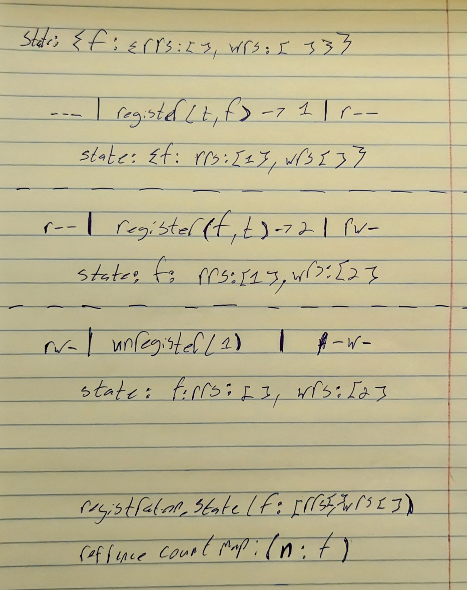

# Assignment Challenge Report

To solve this assignment, I followed a structured approach to tackle the challenges effectively. Here’s a step-by-step explanation of the process:

## Challenges Faced and Solutions

1. **Initial Assessment**:
    - First, I read through the assignment requirements.
    - I used ChatGPT to get a rough assessment of the challenges involved.

2. **Research**:
    - I researched topics I didn't completely understand such as reference counting, other-read/write, and Linux permission management.

3. **Solution Drafting**:
    - I input the entire assignment into ChatGPT again and requested a solution.

4. **Implementation**:
    - I reinstalled .NET and ran a small API project to ensure everything was set up correctly.
    - I then pasted the generated code and started tweaking it. While the initial output wasn't perfect, it was on the right track.

5. **Running the Code**:
    - Since I'm using a Windows machine, I needed Docker to run the `chmod` command. I created a Docker environment and ran everything in it.
    - There were some issues with the way ChatGPT wrote the Linux commands, but I debugged and fixed them.

6. **Main development process**:
    - After getting the code to run, it still didn't produce the correct results. I decided to come up with my own solution on paper. (See image below.)
    - I realized that the direction suggested by ChatGPT was more efficient, so I made it work and wrote tests to ensure it worked correctly.
    - I initially tried to use best practice testing within Docker, but it took too much time. Instead, I wrote a class with a function that tests everything.

7. **Final Steps**:
    - I uploaded the final solution to GitHub.
    - I wrote this README and passed it to ChatGPT for final editing. (yes that why i sound like a robot)

Overall, it was a nice challenge and it took me about 6-8h. Thanks!



## Running the Solution

To run the solution, use the following command:

```sh
docker build -t myconsoleapp . && docker run --rm myconsoleapp
